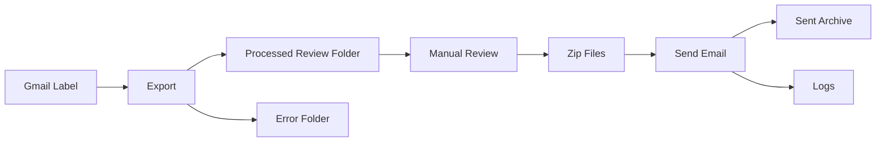

# Email Automation Tool <!-- omit from toc -->


A batch-based workflow that extracts Gmail messages, converts them into structured files, and tracks execution through structured logging.

## Project Documentation <!-- omit from toc -->

This README focuses on setup and usage.

For deeper context on system design, workflow, and the reasoning behind this project, see:

- [System Overview & Design](docs/OVERVIEW.md)
- [Architecture & Flow](docs/ARCHITECTURE.md)
- [Design Decisions](docs/DESIGN_DECISIONS.md)
- [Workflow Lifecycle](docs/WORKFLOW.md)
- [Logging Design](docs/LOGGING.md)

## Table of Contents <!-- omit from toc -->

- [Quick Start](#quick-start)
- [Setup (One-Time)](#setup-one-time)
- [Configuration](#configuration)
- [Workflow Overview](#workflow-overview)
- [Logging](#logging)
- [Project Documentation](#project-documentation)

---

## Design Focus

This project emphasizes traceability, repeatability, and controlled automation over raw speed.

---

## Quick Start

```bash
python -m src export --format text
python -m src send
```

---

## What It Does

- Reads emails from Gmail labels  
- Exports them to text or Word files  
- Organizes files for review and sending  
- Tracks execution with structured logs  

---

## System Flow

```
Gmail → Export → Review → Zip → Send → Archive → Logs
```

---

## System Flow (Visual)



**Note:** This diagram renders automatically on GitHub.
In local editors like VS Code, install a Mermaid extension to preview.

---

## Command Style

This project uses a single package entrypoint:

```bash
python -m src <command>
```

Supported commands:

- `auth`
- `export`
- `send`

Do not run `python run.py`.

---

## Workflow Overview

Run the workflow in two steps:

1. Export emails:

```bash
python -m src export --format text
```

2. Send the batch:

```bash
python -m src send
```

For a detailed step-by-step breakdown, see:
- [Workflow Documentation](docs/WORKFLOW.md)

---

## Configuration

All user configuration is handled through `.env`.

Users should not edit Python source files to change labels, directories, email text, or safety settings.

### Create `.env`

Copy the example file:

```bash
cp .env.example .env
```

On Windows, copy `.env.example` manually and rename it to `.env`.

## `.env` rules

- Values may contain spaces
- Quotes are optional
- Blank values fall back to defaults where supported
- Use `\n` in `SEND_BODY_TEXT` for line breaks

Example:

```env
SEND_SIGNATURE_NAME=Email Automation
SEND_BODY_TEXT=Hello,\n\nAttached is the latest batch of reviewed job files.
```

## Gmail labels

Only the source label is entered as a full label.

The child labels are entered as simple names only. The application builds the full Gmail paths automatically.

Example:

```env
GMAIL_LABEL_SOURCE=for_friend
GMAIL_LABEL_PROCESSED_REVIEW=processed_review
GMAIL_LABEL_ERROR=error
```

This produces:

```text
for_friend
for_friend/processed_review
for_friend/error
```

### Important

Do **not** enter these as full paths:

```env
GMAIL_LABEL_PROCESSED_REVIEW=for_friend/processed_review
GMAIL_LABEL_ERROR=for_friend/error
```

That is now validated and rejected so the config stays clean and predictable.

## Local folders

These are configurable through `.env`:

```env
LOCAL_PROCESSED_REVIEW_DIR=processed_review
LOCAL_READY_TO_SEND_DIR=ready_to_send
LOCAL_SENT_ARCHIVE_DIR=sent_archive
LOCAL_ERROR_DIR=error
```

The logs directory is fixed automatically as:

```text
logs/
```

## Safety settings

Recommended first run:

```env
SEND_EMAILS=False
TEST_MODE=True
CONTINUE_ON_ERROR=True
```

Recommended production setup:

```env
SEND_EMAILS=True
TEST_MODE=False
CONTINUE_ON_ERROR=True
```

### Behavior

- `TEST_MODE=True` prevents real sending
- `SEND_EMAILS=False` prevents real sending
- `CONTINUE_ON_ERROR=True` keeps the export batch moving after failures
- `CONTINUE_ON_ERROR=False` stops the export batch after the first failure

## Gmail API setup

1. Create or select a Google Cloud project
2. Enable the Gmail API
3. Configure the OAuth consent screen
4. Create a Desktop App OAuth client
5. Download the credentials file
6. Place it in the project root or point to it with `.env`

Example:

```env
GOOGLE_CREDENTIALS_FILE=credentials.json
GOOGLE_TOKEN_FILE=token.json
```

## Authenticate Gmail

Run once:

```bash
python -m src auth
```

This creates `token.json` for future runs.

If scopes change or the token becomes invalid, delete `token.json` and run auth again.

## Logging

The application uses structured batch logging with batch IDs, per-item tracking, and run summaries.

For full details, see:
- [Logging Design](docs/LOGGING.md)

## Example output folders

```text
email-automation/
├── processed_review/
├── ready_to_send/
├── sent_archive/
├── error/
├── logs/
└── src/
```

---

## Production Notes

This project is designed for a controlled local workflow with:

- configuration managed through `.env`
- no required code changes for normal operation
- automatic Gmail label handling
- structured logging for traceability

---

## Troubleshooting

### Missing or invalid token

Run:

```bash
python -m src auth
```

### Gmail label not found

Make sure the label exists in Gmail exactly as configured.

### Email not sent

Check:

- `SENDER_EMAIL`
- `RECIPIENT_EMAIL`
- `SEND_EMAILS`
- `TEST_MODE`
- Gmail API authorization

### Nothing to zip

Make sure your processed review folder contains exported files before running:

```bash
python -m src send
```

## Final note

This project is built to answer one operational question cleanly:

> What happened during this run?

That is why the workflow separates export, review, send, and archive, and why every run is wrapped in structured logs.
