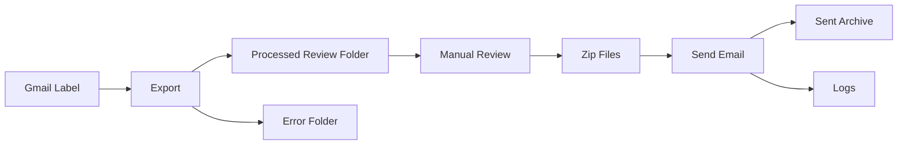

# Email Automation Tool <!-- omit from toc -->


---

A batch-based workflow that extracts Gmail messages, converts them into structured files, and tracks execution through structured logging.

---

## Why I built this

I originally built this to handle job emails more consistently.

Doing it manually worked at first, but it got messy pretty quickly — copying content, renaming files, and trying to remember what was already processed.

After a while, the bigger problem wasn’t speed. It was visibility.

I wanted a simple way to answer:

"What happened during this run?"

This tool is just a structured way to solve that.

---

## Project Documentation <!-- omit from toc -->

This README focuses on setup and usage.

For deeper context on system design, workflow, and the reasoning behind this project, see:

- [System Overview & Design](docs/OVERVIEW.md)
- [Architecture & Flow](docs/ARCHITECTURE.md)
- [Design Decisions](docs/DESIGN_DECISIONS.md)
- [Workflow Lifecycle](docs/WORKFLOW.md)
- [Logging Design](docs/LOGGING.md)

---

## Table of Contents <!-- omit from toc -->

- [Prerequisites](#prerequisites)
- [Setup (One-Time)](#setup-one-time)
- [Quick Start](#quick-start)
- [Configuration](#configuration)
- [Workflow Overview](#workflow-overview)
- [Logging](#logging)
- [Project Documentation](#project-documentation)

---

## Design Focus

This project emphasizes traceability, repeatability, and controlled automation over raw speed.

---

## Prerequisites

Before running this project, make sure the following are installed or available:

- Python 3.10 to 3.12
- pip
- On Windows: install tzdata (use the command `python -m pip install tzdata`)
- A Gmail account
- A Google Cloud project with the Gmail API enabled
- An OAuth Desktop App credentials file downloaded from Google Cloud Console

**NOTE:**  
- Python 3.11 recommended
- Python 3.10 to 3.12 supported for this project
- Python 3.13+ not yet validated
 
---

## Setup (One-Time)

---

### 1. Clone the repository

#### Option A: Clone with Git

```bash
git clone https://github.com/myemail4db/email-automation.git
cd email-automation
```

#### Option B: Download without Git

- Click "Code"
- Select "Download ZIP"
- Extract the folder
- Open a terminal in the project directory

---

### 2. Create a virtual environment. You will stay in here the rest of the time.

#### macOS / Linux

```bash
python -m venv .venv
source .venv/bin/activate
```

#### Windows (Command Prompt)

```bash
python -m venv .venv
.venv\Scripts\activate
```

#### Windows (PowerShell)

```
python -m venv .venv
.venv\Scripts\Activate.ps1
```

---

### 3. Install dependencies

#### macOS / Linux

```bash
python3 -m pip install -r requirements.txt
```

#### Windows

```bash
python -m pip install -r requirements.txt
```

---

### 4. Create .env

Copy the example file:

```bash
cp .env.example .env
```

On Windows, copy `.env.example` manually and rename it to `.env`.

---

####  `.env` rules

- Values may contain spaces
- Quotes are optional
- Blank values fall back to defaults where supported
- Use `\n` in `SEND_BODY_TEXT` for line breaks

Example:

```env
SEND_SIGNATURE_NAME=Email Automation
SEND_BODY_TEXT=Hello,\n\nAttached is the latest batch of reviewed job files.
```

---

### 5. Configure your environment

Open the `.env` file and update the required fields:

- email addresses
   - Email account used to send job batches

   ```
   SENDER_EMAIL=example@gmail.com
   ```

   - Recipient email (where job batches are sent)

   ```
   RECIPIENT_EMAIL=example@gmail.com
   ```

- Gmail labels

**NOTE:** if you don't set these, the default values will be used, but need to exist in your gmail account
  
   ```
   GMAIL_LABEL_SOURCE=
   GMAIL_LABEL_PROCESSED_REVIEW=
   GMAIL_LABEL_ERROR= 
   ```

- local folder settings

**NOTE:** if you don't set these, the default values will be used. These folders are already set in the email_automation project.
  
   ```
   LOCAL_PROCESSED_REVIEW_DIR=
   LOCAL_READY_TO_SEND_DIR=
   LOCAL_SENT_ARCHIVE_DIR=
   LOCAL_ERROR_DIR=
   ```

See the [Configuration](#configuration) section for details.

---

### 6. Gmail API setup

---

#### Important (Read this before continuing)

Most setup issues happen here.

When working with the OAuth steps, in the Google Cloud console, there are a few things to remember. 

Make sure to do the following:

- Under APIs & Services, 
  - then select OAuth consent screen, 
  - Select **External** (not Internal)
- Add your email under **Test Users**
- Login using the SAME Gmail account you added

If any of these are wrong, you will get:

```
403 access_denied
```

This is the most common setup issue.

---

#### Create OAuth Credentials (credentials.json)

To use the Gmail API, you must create an OAuth client and download a `credentials.json` file.

##### Steps

1. Go to Google Cloud Console:
   https://console.cloud.google.com/

2. Create or select a project

3. Enable the Gmail API
   - Navigate to: APIs & Services → Library
   - Search for: Gmail API
   - Click “Enable”

4. Configure OAuth Consent Screen
   - Go to: APIs & Services → OAuth consent screen
   - Choose **External**
   - Fill in required fields (App name, Email)
   - Save

5. Create OAuth Client ID

   This step connects your Gmail account securely so the program can read labeled emails.

   - Go to: APIs & Services → Credentials
   - Click **Create Credentials → OAuth client ID**
   - Application type: **Desktop app**
   - Click Create

6. Download credentials
   - Click the download icon
   - Save the file as:

```
credentials.json
```

7. Place the file in your project root directory:

```
email-automation/
├── credentials.json
├── .env
├── src/
```

---

##### Important
   - Do not rename the file unless you update .env
   - Do not commit credentials.json to source control
   - Keep this file secure

---

### Safety Settings

#### Recommended first run:

```env
SEND_EMAILS=False
TEST_MODE=True
CONTINUE_ON_ERROR=True
```

**NOTE:** See the Configuration Section to configure these for the production run

#### Behavior

- `TEST_MODE=True` prevents real sending
- `SEND_EMAILS=False` prevents real sending
- `CONTINUE_ON_ERROR=True` keeps the export batch moving after failures
- `CONTINUE_ON_ERROR=False` stops the export batch after the first failure

---

### 7. Authenticate

After placing credentials.json, run:

```bash
python -m src auth
```

This will:
   - open a browser
   - prompt for Gmail login
   - generate token.json

---

## Command Style

This project uses a single package entrypoint:

```bash
python -m src <command>
```

Supported commands:

- `auth`
- `export`
- `send`

Do not run `python run.py`.

---

## Quick Start

```bash
python -m src export --format text
python -m src send
```

---

## What It Does

- Reads emails from Gmail labels  
- Exports them to text or Word files  
- Organizes files for review and sending  
- Tracks execution with structured logs  

---

## System Flow

```
Gmail → Export → Review → Zip → Send → Archive → Logs
```

---

## System Flow (Visual)



**Note:** This diagram renders automatically on GitHub.
In local editors like VS Code, install a Mermaid extension to preview.

---

## Workflow Overview

Run the workflow in two steps:

1. Export emails:

```bash
python -m src export --format text
```

2. Send the batch:

```bash
python -m src send
```

For a detailed step-by-step breakdown, see:
- [Workflow Documentation](docs/WORKFLOW.md)

---

## Configuration

This section provides detailed reference information for configuring the `.env` file.

During setup, you only need to update the required fields.  
Use this section for full descriptions, optional settings, and advanced configuration.

---

### Create `.env`

Copy the example file:

```bash
cp .env.example .env
```

On Windows, copy `.env.example` manually and rename it to `.env`.

---

####  `.env` rules

- Values may contain spaces
- Quotes are optional
- Blank values fall back to defaults where supported
- Use `\n` in `SEND_BODY_TEXT` for line breaks

Example:

```env
SEND_SIGNATURE_NAME=Email Automation
SEND_BODY_TEXT=Hello,\n\nAttached is the latest batch of reviewed job files.
```

---

### Gmail labels

Only the source label is entered as a full label.

The child labels are entered as simple names only. The application builds the full Gmail paths automatically.

Example:

```env
GMAIL_LABEL_SOURCE=for_friend
GMAIL_LABEL_PROCESSED_REVIEW=processed_review
GMAIL_LABEL_ERROR=error
```

This produces:

```text
for_friend
for_friend/processed_review
for_friend/error
```

---

#### Important

Do **not** enter these as full paths:

```env
GMAIL_LABEL_PROCESSED_REVIEW=for_friend/processed_review
GMAIL_LABEL_ERROR=for_friend/error
```

That is now validated and rejected so the config stays clean and predictable.

---

### Local folders

These are configurable through `.env`:

```env
LOCAL_PROCESSED_REVIEW_DIR=processed_review
LOCAL_READY_TO_SEND_DIR=ready_to_send
LOCAL_SENT_ARCHIVE_DIR=sent_archive
LOCAL_ERROR_DIR=error
```

The logs directory is fixed automatically as:

```text
logs/
```

### Safety Settings

#### Recommended production setup:

```env
SEND_EMAILS=True
TEST_MODE=False
CONTINUE_ON_ERROR=True
```

These settings control how the application behaves during execution.

- SEND_EMAILS
    - True → emails will be sent
    - False → sending is disabled
  
- TEST_MODE
    - True → no real actions are performed (safe testing)
    - False → full execution
  
- CONTINUE_ON_ERROR
    - True → continues processing after failures
    - False → stops on first error

---

## Production Notes

This project is designed for a controlled local workflow with:

- configuration managed through `.env`
- no required code changes for normal operation
- automatic Gmail label handling
- structured logging for traceability

---

## Troubleshooting

<style>
  /* Define a custom class for red text */
  .error {
    color: #FF0000;
  }

  /* Style all Level 2 headers to be blue */
  .solution {
    color: green;
  }
</style>

### <span class="error">403 access_denied</span>

This usually means Google blocked your app.

<span class="solution">Solution</span>

Check:

1. OAuth user type is set to **External**
2. Your Gmail account name is added as a **Test User**
3. You are logging in with that same Gmail account

If unsure:
- open auth in an incognito window
- log in fresh

---

### <span class="error">No module named 'tzdata'</span>

This is a tzdata error.

<span class="solution">Solution</span>
```bash
python -m pip install tzdata
```

---

### <span class="error">Missing or invalid token</span>

The authorization token cannot be used.

<span class="solution">Solution</span>

Run the command to create a new token:

```bash
python -m src auth
```

---

### <span class="error">Gmail label not found</span>

<span class="solution">Solution</span>

The label must exist exactly as written.

Example:

```
for_friend
```

Check spelling and capitalization.

---

### <span class="error">Auth worked but export fails</span>

Usually means:
timezone issue (tzdata)
incorrect .env values

<span class="solution">Solution</span>

Check the values in the `.env` file for:
- DISPLAY_TIMEZONE
- label names

---

### <span class="error">Email not sent</span>

<span class="solution">Solution</span>

Check the values in the `.env` file for:

- `SENDER_EMAIL`
- `RECIPIENT_EMAIL`
- `SEND_EMAILS`
- `TEST_MODE`
- Gmail API authorization

---

### <span class="error">### Nothing to zip</span>

<span class="solution">Solution</span>

Make sure your processed review folder contains exported files before running:

```bash
python -m src send
```

---

## Final note

This project is built to answer one operational question cleanly:

> What happened during this run?

That is why the workflow separates export, review, send, and archive, and why every run is wrapped in structured logs.
